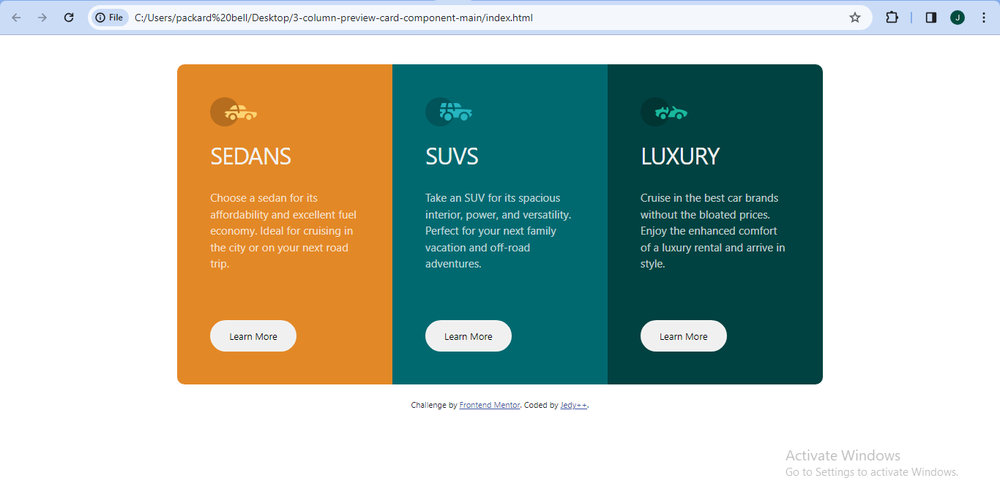

# Frontend Mentor - 3-column preview card component solution

This is a solution to the [3-column preview card component challenge on Frontend Mentor](https://www.frontendmentor.io/challenges/3column-preview-card-component-pH92eAR2-). Frontend Mentor challenges help you improve your coding skills by building realistic projects. 

## Table of contents

- [Overview](#overview)
  - [The challenge](#the-challenge)
  - [Screenshot](#screenshot)
  - [Links](#links)
- [My process](#my-process)
  - [Built with](#built-with)
- [Author](#author)
- [Acknowledgments](#acknowledgments)

**Note: Delete this note and update the table of contents based on what sections you keep.**

## Overview

### The challenge

Users should be able to:

- View the optimal layout depending on their device's screen size
- See hover states for interactive elements

### Screenshot

A screenshot of my solution has been attached using the file path above

### Links

- Solution URL: (https://www.frontendmentor.io/solutions/responsive-3column-preview-card-component-LjA0MQUlZI)
- Live Site URL: (https://https://3-card-column-preview-component.netlify.app/)

## My process

### Built with

- Semantic HTML5 markup
- CSS custom properties
- Flexbox
- Mobile-first workflow 

## Author

- Website - [3-card-column-preview-component](https://3-card-column-preview-component.netlify.app/)
- Frontend Mentor - [@Jedyokey](https://www.frontendmentor.io/profile/Jedyokey)
- Twitter - [@jedy_NFT](https://www.twitter.com/jedy_NFT)
